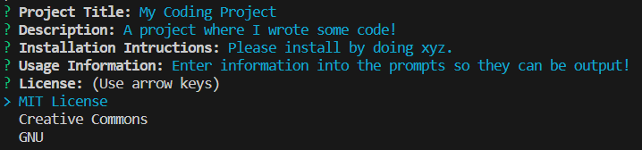

# README File Generator!

## Description

This projects auto-generates a README file via the command line from user inputs so you can have a professional-looking README in no time!

## Table of Contents 

- [Installation](#installation)
- [Usage](#usage)
- [Credits](#credits)
- [License](#license)

## Installation

This project uses Node.js!
You can install Node here:  
https://www.freecodecamp.org/news/node-version-manager-nvm-install-guide/  

Inquirer is also used, which can be installed here:  
https://www.npmjs.com/package/inquirer#questions

## Usage

Run 'node index' in your terminal and enter information into the prompts. Screenshot below. Once all prompts have been popluated, a README file should be generated.

## Credits

Columbia University Coding Bootcamp

## License

MIT License  (https://opensource.org/licenses/MIT)

## How to Contribute

Follow the [Contributor Covenant](https://www.contributor-covenant.org/)!

## Tests

Enter a free text string for each input. Ensure that each item is being treated as a variable and place appropriately within the README!
